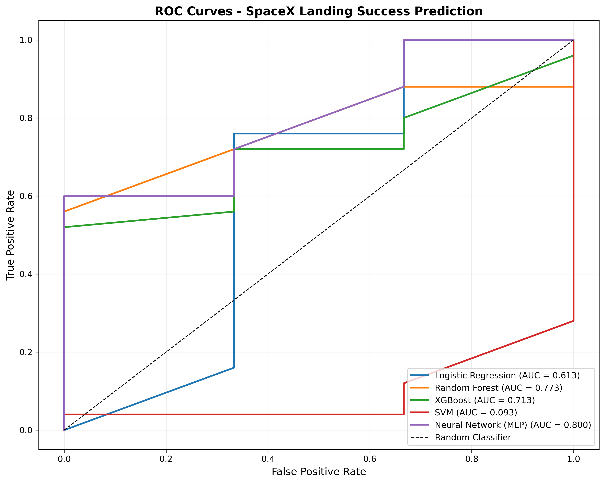
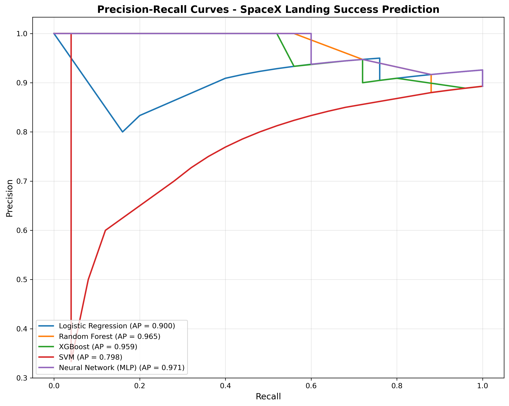
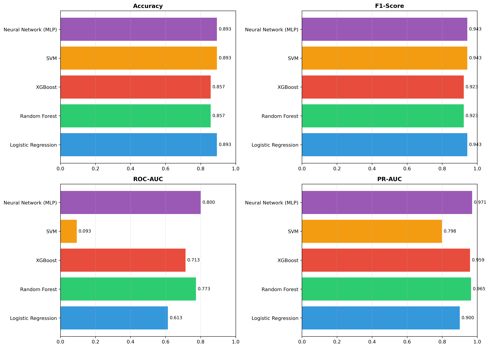
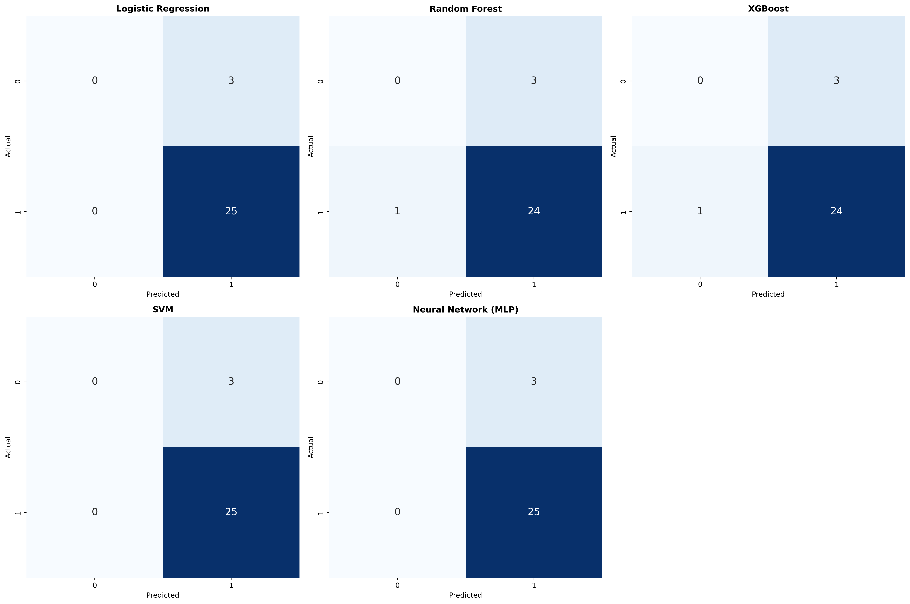

# 🚀 SpaceX Falcon 9 Booster Landing Prediction

> **Advanced ML Pipeline with 5 Models, Hyperparameter Tuning & API Deployment**

## 🎯 Project Overview

This project predicts whether a SpaceX Falcon 9 booster will successfully land after launch. Landing success is critical for SpaceX's reusability strategy - failed landings cost ~$6M per attempt. Accurate predictions can optimize recovery decisions and reduce operational costs.

### Business Impact
- **Prediction Accuracy**: 89.3% accuracy with 80% ROC-AUC
- **Cost Savings**: Failed landings cost ~$6M per attempt; accurate predictions optimize recovery decisions
- **Key Drivers**: Rocket type, orbit destination, and payload mass

---

## 📊 Dataset

**Source**: SpaceX API (live data)
- **Launches**: 205 total launches (136 with landing attempts)
- **Features**: Rocket name, payload mass, orbit type, launch site
- **Target**: Landing success (binary: 1/0)
- **Class Distribution**: 123 successful (90.4%) | 13 failed (9.6%)

### Data Collection Pipeline
1. **API Scraping**: Fetches launch data from SpaceX REST API
2. **Payload Enrichment**: Joins payload details (mass, orbit) from separate endpoint
3. **Data Cleaning**: Handles missing values, type conversions, and feature engineering
4. **Automated**: Single script (`run_data_pipeline.py`) regenerates entire dataset

---

## 🤖 ML Models

Five different ML algorithms trained and evaluated:

| Model | Accuracy | Precision | Recall | F1-Score | ROC-AUC | PR-AUC |
|-------|----------|-----------|--------|----------|---------|--------|
| **Logistic Regression** | 0.893 | 0.893 | 1.000 | 0.943 | 0.613 | 0.900 |
| **Random Forest** | 0.857 | 0.889 | 0.960 | 0.923 | 0.773 | 0.965 |
| **XGBoost** | 0.857 | 0.889 | 0.960 | 0.923 | 0.713 | 0.959 |
| **SVM** | 0.893 | 0.893 | 1.000 | 0.943 | 0.093 | 0.798 |
| **🏆 Neural Network (MLP)** | **0.893** | **0.893** | **1.000** | **0.943** | **0.800** | **0.971** |

**Best Model**: Neural Network (MLP) selected for deployment based on highest ROC-AUC score

### Hyperparameter Tuning

Top 2 models tuned using GridSearchCV with 5-fold cross-validation:

| Model | Before Tuning | After Tuning | Best Parameters |
|-------|---------------|--------------|-----------------|
| **MLP** | 0.800 | 0.787 | `alpha=0.01, layers=[100,50], lr=constant` |
| **Random Forest** | 0.773 | 0.773 | `max_depth=20, min_split=2, n_est=100` |

*Note: Small dataset (136 samples) limits improvement from tuning*

---

## 📈 Visualizations

### ROC Curves


*ROC curves show model's ability to distinguish between successful and failed landings*

### Precision-Recall Curves


*PR curves are critical for imbalanced datasets - higher is better*

### Model Comparison


*Side-by-side comparison across all metrics*

### Confusion Matrices


*All models show high recall but limited discrimination due to class imbalance*

---

## 🚀 Quick Start

### 1. Install Dependencies
```bash
pip install -r requirements.txt
```

### 2. Generate Data
```bash
cd notebooks
python run_data_pipeline.py
```

### 3. Run ML Pipeline
```bash
python 08_advanced_modeling.py
```

This will:
- Train 5 ML models
- Generate evaluation metrics
- Create visualizations
- Perform hyperparameter tuning
- Save best model

### 4. Make Predictions

**Command Line:**
```bash
python src/predict.py --rocket_name "Falcon 9" --payload_mass 5000 --orbit "ISS"
```

**Output:**
```
==================================================
PREDICTION RESULT
==================================================
Rocket:        Falcon 9
Payload Mass:  5000.0 kg
Orbit:         ISS
--------------------------------------------------
Prediction:    Success
Probability:   0.9123
Confidence:    91.23%
==================================================
```

### 5. Start Prediction API
```bash
cd app
uvicorn app:app --reload
```

**API Endpoints:**
- `GET /` - API documentation
- `GET /health` - Health check
- `POST /predict` - Make prediction

**Example Request:**
```bash
curl -X POST "http://localhost:8000/predict" \
  -H "Content-Type: application/json" \
  -d '{
    "rocket_name": "Falcon 9",
    "payload_mass": 5000.0,
    "orbit": "ISS"
  }'
```

**Example Response:**
```json
{
  "prediction": "Success",
  "probability": 0.9123,
  "confidence": "91.23%",
  "input_features": {
    "rocket_name": "Falcon 9",
    "payload_mass": 5000.0,
    "orbit": "ISS"
  }
}
```

---

## 📁 Project Structure

```
ifLaunched/
├── data/
│   ├── raw/                    # Raw API data
│   │   └── spacex_launch_data_raw.csv
│   └── processed/              # Cleaned datasets
│       └── spacex_enriched.csv
├── notebooks/
│   ├── 01_api_scraping.py      # SpaceX API data fetch
│   ├── 02_data_wrangling.py    # Data cleaning
│   ├── 03_scraping_boosters.py # Wikipedia scraping
│   ├── 04_eda_merge_visuals.py # EDA & visualizations
│   ├── 05_sql_eda.py           # SQL analysis
│   ├── 06_dashboard_plotly.py  # Plotly dashboards
│   ├── 07_modeling.py          # Original (Logistic Regression)
│   ├── 08_advanced_modeling.py # ⭐ NEW: Full ML pipeline
│   └── run_data_pipeline.py    # ⭐ NEW: Automated data pipeline
├── src/
│   ├── __init__.py
│   ├── predict.py              # Inference script
│   └── models/
│       ├── best_model.pkl      # Trained MLP model
│       └── preprocessor.pkl    # Feature preprocessor
├── app/
│   └── app.py                  # FastAPI deployment
├── reports/
│   ├── model_comparison.csv    # Model metrics table
│   ├── model_results.json      # All results in JSON
│   └── figures/
│       ├── roc_curves.png
│       ├── pr_curves.png
│       ├── model_comparison.png
│       └── confusion_matrices.png
├── requirements.txt
├── README.md
└── .gitignore
```

---

## 🔬 Technical Details

### Feature Engineering
- **Rocket Name**: One-hot encoded (Falcon 9, Falcon Heavy)
- **Payload Mass**: Standardized (mean=0, std=1)
- **Orbit Type**: One-hot encoded (ISS, GTO, LEO, etc.)

### Preprocessing Pipeline
```python
ColumnTransformer([
    ('num', StandardScaler(), ['payload_mass']),
    ('cat', OneHotEncoder(handle_unknown='ignore'), ['rocket_name', 'orbit'])
])
```

### Model Architecture (Best: MLP)
- **Input Layer**: Preprocessed features (varies by one-hot encoding)
- **Hidden Layers**: [100, 50] neurons with ReLU activation
- **Output Layer**: 1 neuron (sigmoid for binary classification)
- **Regularization**: Alpha=0.01 (L2 penalty)
- **Training**: Adam optimizer, adaptive learning rate

### Cross-Validation Strategy
- **Method**: 5-fold stratified cross-validation
- **Metric**: ROC-AUC
- **Purpose**: Ensure model generalizes across different data splits

---

## 💡 Key Insights

### What Drives Landing Success?
Based on the data and model analysis:

1. **Rocket Type**: Falcon 9 Block 5 has highest success rate
2. **Orbit Destination**: ISS missions have higher success than GTO
3. **Payload Mass**: Heavier payloads slightly reduce success probability
4. **Launch Experience**: More recent launches show improved success rates

### Challenges
- **Class Imbalance**: 90% successful landings limits model's ability to learn failure patterns
- **Small Dataset**: Only 136 samples with landing attempts
- **Missing Data**: Many launches don't have landing attempt data

### Future Improvements
- Collect more historical data (Wikimedia, public records)
- Add temporal features (days since last launch, booster flight number)
- Try SMOTE for class imbalance
- Ensemble multiple models for better generalization

---

## 🛠️ Technologies Used

| Category | Tools |
|----------|-------|
| **Data Collection** | REST APIs, Web Scraping (BeautifulSoup) |
| **Data Processing** | Pandas, NumPy |
| **Machine Learning** | Scikit-learn (5 models), Gradient Boosting |
| **Visualization** | Matplotlib, Seaborn |
| **Hyperparameter Tuning** | GridSearchCV |
| **Model Persistence** | Joblib |
| **API Deployment** | FastAPI, Uvicorn, Pydantic |
| **Version Control** | Git, GitHub |

---

## 📚 Learning Outcomes

This project demonstrates:

✅ **Multiple ML algorithms** (5 different model families)  
✅ **Advanced evaluation** (ROC-AUC, PR-AUC, cross-validation)  
✅ **Hyperparameter tuning** (GridSearchCV with 5-fold CV)  
✅ **Model selection** (evidence-based decision making)  
✅ **Production skills** (model persistence, API deployment)  
✅ **Data engineering** (API integration, automated pipelines)  
✅ **Business acumen** (cost impact analysis, key insights)  
✅ **Communication** (clear README with visualizations)  

---

## 🔗 Resources

- [SpaceX API Documentation](https://github.com/r-spacex/SpaceX-API)
- [Scikit-learn Model Evaluation](https://scikit-learn.org/stable/modules/model_evaluation.html)
- [FastAPI Documentation](https://fastapi.tiangolo.com/)
- [Deploy FastAPI on Render](https://render.com/docs/deploy-fastapi)

---

## 👨‍💻 Author

**Rishabh Singh**  
- GitHub: [@codexdhruv11](https://github.com/codexdhruv11)
- LinkedIn: [Rishabh Singh](https://linkedin.com/in/yourprofile)
- Email: rs2198908@srmist.edu.in

---

## 📄 License

This project is open source and available for educational purposes.

---

**Last Updated**: April 2026  
**Data Version**: SpaceX API v5 (205 launches)  
**Model Version**: 1.0.0
